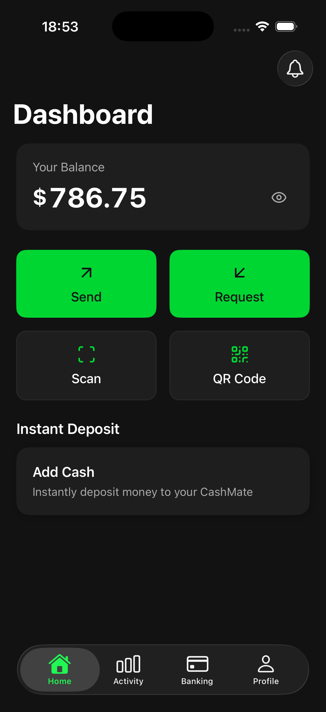
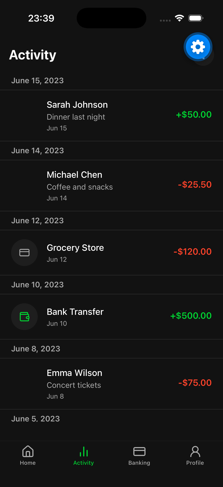
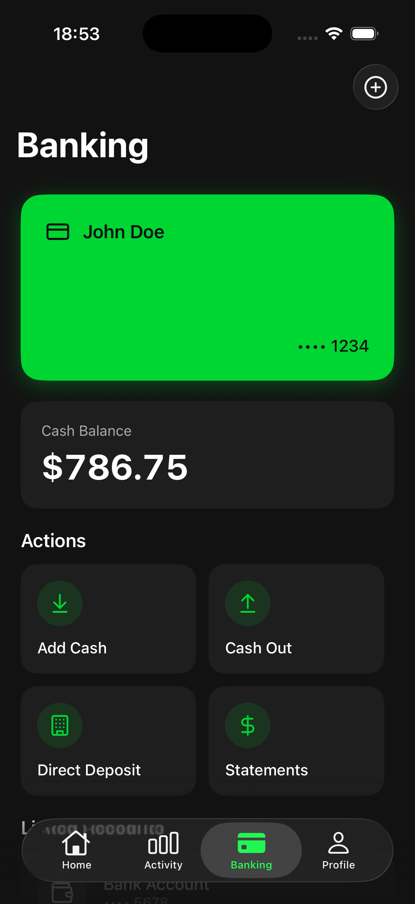
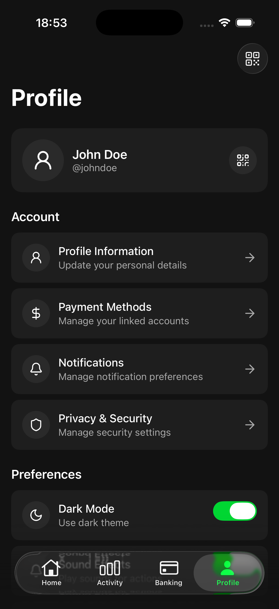
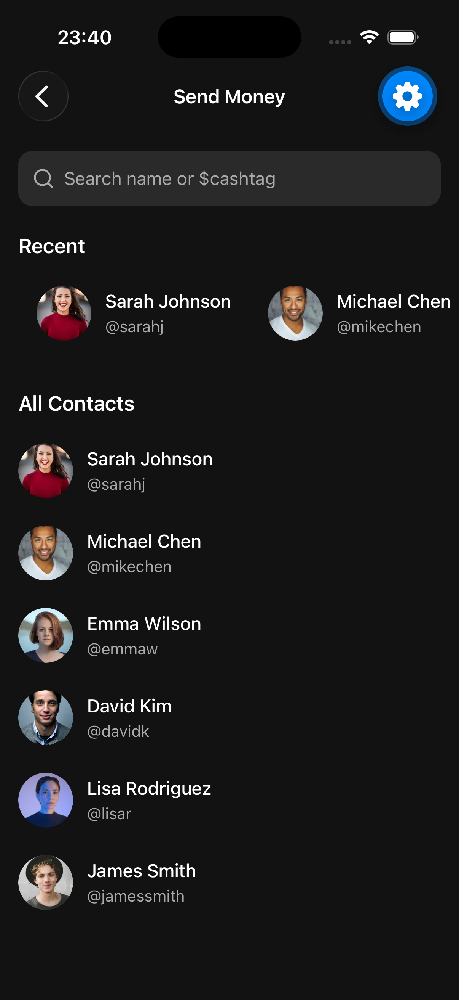
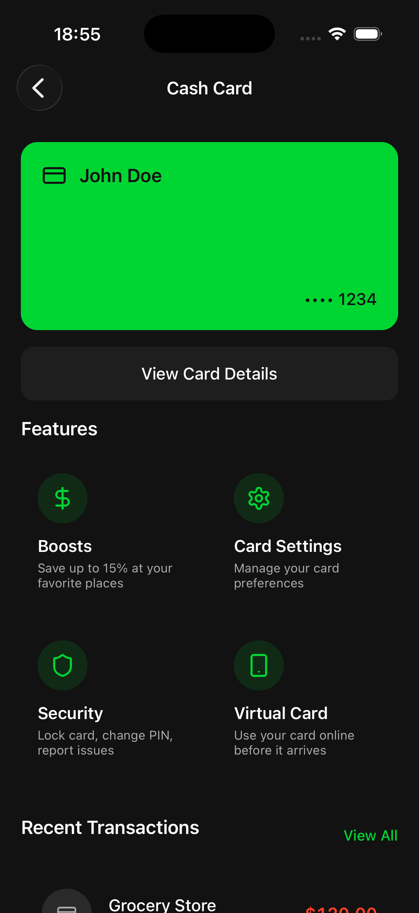
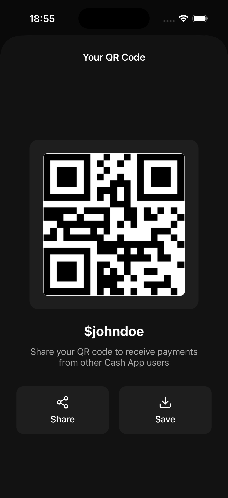

<div align="center">

<!-- Replace with your app logo -->
<!--  -->

# 💸 CashMate

**Personal finance & peer-to-peer payment app**

[](https://expo.dev)
[](https://reactnative.dev)
[](https://react.dev)
[](https://www.typescriptlang.org)
[](./LICENSE)
[](https://github.com/ekimkael/cashmate/releases/tag/v0.1.0-beta.1)
[](./CONTRIBUTING.md)

A fully-featured **mobile UI prototype** for a digital wallet and P2P payment experience — built with Expo SDK 56, React 19, and TypeScript.

</div>

---

## Features

- **💳 Virtual Debit Card** — card details, lock/unlock, PIN management, boosts, virtual card for online use, card design customization
- **📤 Send & Receive Money** — contact-based P2P transfers with confirmation flow
- **💰 Deposit & Cash Out** — link bank accounts, deposit funds, withdraw to bank
- **📊 Transaction History** — filterable activity feed (sent, received, payments, deposits, withdrawals)
- **🏦 Banking Dashboard** — balance overview, linked accounts, direct deposit setup
- **🔍 QR Code Payments** — scan to pay or display personal QR code
- **🔒 Security & Privacy** — card lock, PIN, security alerts, login history, blocked users
- **⚙️ Account Management** — profile editing, notifications, language, currency, statements, data export
- **🌙 Dark / Light Theme** — polished theme system with signature green accent (`#00D632`)
- **📱 Cross-Platform** — runs on iOS, Android, and Web

---

## Screenshots

| Home | Activity | Banking | Profile |
|------|----------|---------|---------|
|  |  |  |  |

| Send Flow | Card Management | QR Code |
|-----------|----------------|---------|
|  |  |  |

---

## Tech Stack

| Category | Technology |
|----------|-----------|
| Framework | [Expo](https://expo.dev) 56 + [React Native](https://reactnative.dev) 0.85 |
| Language | [TypeScript](https://www.typescriptlang.org) 6.0 |
| Navigation | [Expo Router](https://expo.github.io/router) v4 (file-based, typed routes) |
| Styling | React Native StyleSheet + dynamic theme via `useThemeColors` |
| State | [Zustand](https://zustand-demo.pmnd.rs) 5 + AsyncStorage persistence |
| Icons | [Lucide React Native](https://lucide.dev) + Expo Symbols |
| UI Effects | Expo Blur, Expo Linear Gradient, Expo Haptics |
| Images | Expo Image, Expo Image Picker |
| Testing | Jest + jest-expo |
| React Compiler | Enabled (experimental) |

---

## Getting Started

### Prerequisites

- [Node.js](https://nodejs.org) ≥ 20
- [npm](https://www.npmjs.com) ≥ 10
- [Expo Go](https://expo.dev/go) on your device, **or** an iOS/Android simulator

### Installation

```bash
# Clone the repository
git clone https://github.com/ekimkael/cashmate.git
cd cashmate

# Install dependencies
npm install --legacy-peer-deps

# Start the development server
npm start
```

> **Note:** `--legacy-peer-deps` is required because `lucide-react-native` declares a peer dependency on React 16–18, while this project uses React 19.

### Running on a specific platform

```bash
npm run ios       # iOS simulator
npm run android   # Android emulator
npm run web       # Web browser
```

> **Note:** This is a UI prototype. All data is mocked locally — no backend or network calls are made.

---

## Project Structure

```
cashmate/
├── app/                        # Expo Router — file-based routing
│   ├── (tabs)/                 # Bottom tab navigation
│   │   ├── (home)/index.tsx    # Home / Dashboard
│   │   ├── (activity)/index.tsx  # Transaction history
│   │   ├── (banking)/index.tsx   # Card & account management
│   │   └── (profile)/index.tsx   # Settings & profile
│   ├── auth/                   # Authentication screens
│   │   ├── login.tsx
│   │   ├── register.tsx
│   │   └── forgot-password.tsx
│   ├── send/                   # P2P send money flow
│   ├── request/                # Request money flow
│   ├── deposit.tsx             # Deposit flow
│   ├── cashout.tsx             # Cash out flow
│   ├── card.tsx                # Card management
│   └── [utility screens]       # Settings, help, privacy, etc.
│
├── components/                 # Reusable UI components
│   └── ui/
│       ├── balance-card.tsx
│       ├── action-button.tsx
│       ├── num-pad.tsx
│       ├── contact-item.tsx
│       ├── transaction-item.tsx
│       └── hstack.tsx
│
├── hooks/                      # Custom React hooks
│   ├── use-amount-input.ts     # Numeric keypad state (send, request, deposit, cashout)
│   ├── use-haptic-navigation.ts  # Haptic feedback + router.push
│   └── use-require-user.ts     # Auth guard with auto-redirect
│
├── store/                      # Zustand global state
│   ├── user-store.ts           # User session & balance
│   ├── transaction-store.ts    # Transaction history
│   ├── app-store.ts            # App readiness & persisted preferences
│   └── theme-store.ts          # Dark / light theme toggle
│
├── types/                      # TypeScript type definitions
├── mocks/                      # Seed / demo data
├── constants/                  # Colors, theme tokens
├── assets/                     # Fonts, images, icons
├── app.json                    # Expo configuration
└── package.json
```

---

## Architecture

### State Management

Four Zustand stores, all persisted to `AsyncStorage`:

```
user-store
  ├── user: User | null
  ├── setUser(user)
  ├── updateBalance(amount)
  └── logout()

transaction-store
  ├── transactions: Transaction[]
  └── addTransaction(tx)        # also calls updateBalance

app-store
  ├── isAppReady: boolean
  ├── notifications: boolean
  ├── soundEffects: boolean
  ├── hapticFeedback: boolean
  ├── setAppReady()
  └── togglePreference(key)

theme-store
  ├── isDark: boolean
  └── toggle()
```

### Custom Hooks

| Hook | Purpose |
|------|---------|
| `useAmountInput` | Numeric keypad state shared across send, request, deposit, cashout |
| `useHapticNavigation` | Haptic feedback + `router.push` — used across all tab screens |
| `useRequireUser` | User guard with auto-redirect to `/auth/login` if not authenticated |

### Routing Pattern

Expo Router uses a file-based convention. Every file in `app/` maps to a route. Tabs are grouped under `app/(tabs)/`. Authentication screens live in `app/auth/`. Typed routes are enabled — all `router.push` calls use the `Href` type from `expo-router`.

### Data Flow

```
Mock Data (mocks/data.ts)
       │
       ▼
  Zustand Stores  ◄──────── User interactions
       │
       ▼
  Screen Components  ──►  Expo Router navigation
```

---

## Roadmap

This is a UI prototype. Planned features for future versions:

- [ ] **Real Authentication** — JWT / OAuth 2.0, biometric login
- [ ] **REST / GraphQL API** — replace mock data with a real backend
- [ ] **Live Payments** — integrate Stripe or a payment processor
- [ ] **Push Notifications** — transaction alerts, security events
- [ ] **Biometric Security** — Face ID / fingerprint for card actions
- [ ] **Internationalisation** — multi-language support (i18n)
- [ ] **E2E Tests** — Detox test suite

---

## Contributing

Contributions are welcome! Please read through the workflow before opening a PR.

### Branch Strategy

```
main        ← stable, production-ready releases (protected)
develop     ← default integration branch — open PRs here
feature/*   ← new features (branch from develop)
fix/*       ← bug fixes (branch from develop)
```

### Workflow

```bash
# 1. Fork & clone
git clone https://github.com/<your-handle>/cashmate.git

# 2. Create a feature branch from develop
git checkout develop
git checkout -b feature/my-feature

# 3. Install dependencies
npm install --legacy-peer-deps

# 4. Commit using Conventional Commits
git commit -m "feat(send): add amount validation"

# 5. Push and open a PR targeting develop
git push origin feature/my-feature
```

### Commit Convention

This project uses [Conventional Commits](https://www.conventionalcommits.org):

| Prefix | Use for |
|--------|---------|
| `feat` | New feature |
| `fix` | Bug fix |
| `style` | UI / style changes |
| `refactor` | Code restructuring |
| `chore` | Tooling, config, deps |
| `docs` | Documentation |
| `test` | Tests |

---

## License

Distributed under the **MIT License**. See [`LICENSE`](./LICENSE) for details.

---

<div align="center">

Made with ❤️ by [ekimkael](https://github.com/ekimkael)

</div>
